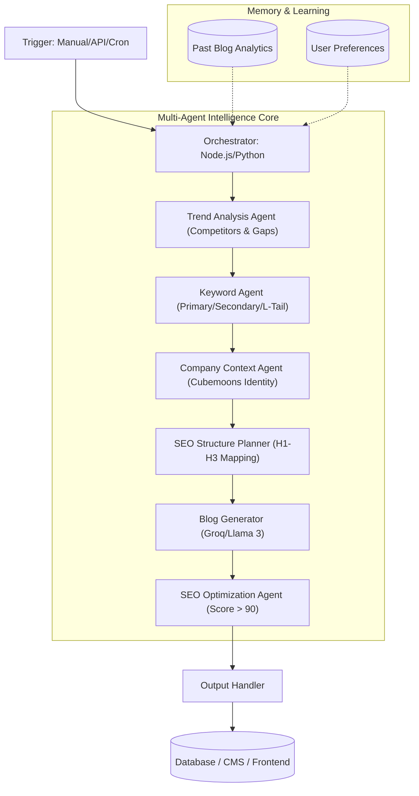

# 🤖 AI Blogging Agent: Complete Execution System

> [!IMPORTANT]
> This document defines the **Architectural Blueprint** and **Event-Driven Workflow** for the **Cubemoons AI Blogging Agent**. It serves as the master guide for implementing the multi-agent orchestration system.

---

## 🧩 1. System Overview
The **AI Blogging Agent** is an autonomous, event-driven pipeline that transforms a simple topic into a high-ranking, SEO-optimized, brand-aligned blog post. It utilizes a **Multi-Agent Orchestration (MAO)** pattern where specialized agents handle specific stages of the content lifecycle.

### 🌊 Core Logic Flow
`User Input` ➔ `Trigger` ➔ `Multi-Agent Processing` ➔ `Generation` ➔ `Optimization` ➔ `Output`

---

## 🏗️ 2. High-Level Architecture


---

## ⚡ 3. The Event-Driven Pipeline (Step-by-Step)

### 🟢 Phase 1: Trigger System
*   **Manual Trigger:** Admin enters a topic (e.g., *"AI Automation in Startups"*).
*   **Scheduled Trigger (Cron):** System automatically fires every Monday at 10 AM.
*   **Performance Trigger:** If an existing blog's traffic drops below a threshold, the system triggers a "Regeneration Event."
*   **Initial Event:** `BLOG_REQUEST_RECEIVED`

### 🔍 Phase 2: Trend Analysis Agent
*   **Input:** Topic + Target Region.
*   **Action:** Scrapes Top 5 Google results, analyzes competitor H1/H2 structures, and identifies "Content Gaps."
*   **Output Event:** `TREND_ANALYSIS_COMPLETED`

### 🔑 Phase 3: Keyword Agent
*   **Action:** Generates Primary, Secondary, and Long-tail keywords based on Search Volume and Difficulty.
*   **Output Event:** `KEYWORDS_READY`

### 🏢 Phase 4: Company Context Agent (Cubemoons)
*   **Identity Injection:** Infuses the blog with **Cubemoons**' professional tone, core services (AI Solutions, Automation), and unique positioning.
*   **Output Event:** `CONTEXT_READY`

### 🧱 Phase 5: SEO Structure Planner
*   **Action:** Maps out the SEO Title, Meta Description, and a logical Heading hierarchy (H1-H3).
*   **Output Event:** `STRUCTURE_READY`

### ✍️ Phase 6: Blog Generation Agent (Powered by Groq)
*   **Action:** High-speed generation using **Llama 3 (via Groq API)**.
*   **Constraint:** Must follow the Keyword Placement Plan and Brand Voice.
*   **Output Event:** `BLOG_GENERATED`

### 📈 Phase 7: SEO Optimization Agent
*   **Action:** Refines keyword density, adds FAQs, suggests internal links, and creates a compelling Call-to-Action (CTA).
*   **Health Check:** Calculates an **SEO Score** (Target: >90).
*   **Output Event:** `SEO_OPTIMIZED`

### 📦 Phase 8: Output & Handover
*   **Action:** Formats output into JSON/Markdown and pushes to CMS or Database.
*   **Final Event:** `FINAL_OUTPUT_READY`

---

## 🧠 4. Memory & Learning System (Bonus)
The system doesn't just generate; it **evolves**.
1.  **Feedback Loop:** Stores CTR and dwell time of published blogs.
2.  **Fine-Tuning:** Uses performance data to adjust the "Trend Analysis" parameters for the next run.
3.  **Pattern Recognition:** Identifies which keyword types convert best for the "Cubemoons" brand.

---

## 🛠️ 5. Implementation Stack (Recommended)

| Layer | Technology |
| :--- | :--- |
| **Orchestrator** | Node.js (Express/BullMQ) or Python (FastAPI/Celery) |
| **LLM Engine** | Groq API (Llama 3.3 70B Versatile) |
| **Data Scraping** | Serper.dev / Puppeteer / Brave Search API |
| **Database** | PostgreSQL (Metadata) + Vector DB (Pinecone/Milvus for Memory) |
| **Automation** | GitHub Actions / Cron Jobs |

---

## 🚀 6. Setup Instructions (Quick Start)

### 1️⃣ Environment Configuration
Create a `.env` file with the following:
```bash
GROQ_API_KEY=your_groq_key
SERPER_API_KEY=your_search_key
DB_CONNECTION_STRING=your_database_url
CUBEMOONS_CONTEXT_PROMPT="Cubemoons is a premier AI automation agency..."
```

### 2️⃣ Agent Initialization
Each agent should be a modular service or function within the Orchestrator.
```javascript
// Example Orchestrator Function
async function runBloggingPipeline(topic) {
    const trends = await trendAgent.analyze(topic);
    const keywords = await keywordAgent.generate(trends);
    const context = await companyAgent.getContext();
    const structure = await seoPlanner.createPlan(keywords, context);
    const draft = await blogGenerator.write(structure);
    const finalBlog = await seoOptimizer.polish(draft);
    
    return outputHandler.save(finalBlog);
}
```

### 3️⃣ Monitoring & Logs
Track the state of each event in your database to allow for "resume from failure" capabilities.

---

> [!TIP]
> **Pro Tip:** Use a "Human-in-the-loop" flag during the `STRUCTURE_READY` event to allow an editor to approve the outline before the full blog is generated, saving API costs and ensuring quality.
